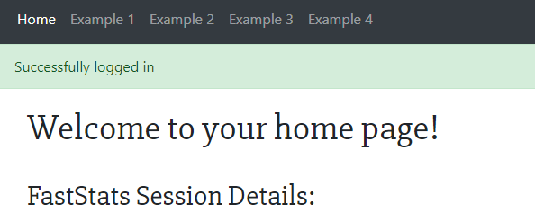

# Flight Delay App
An example web app using the py-apteco and apteco-api Python packages

## Pre-requisites
- Python 3.7 installed (for this readme, it is executed by the command `python`)
- pip 19.* installed
- The _Flight Delays_ FastStats system with Apteco Orbit™ set up.

## Installation
1. Clone the GitHub repository  
    `git clone https://github.com/Apteco/flight-delay-app.git`
2. From the `flight-delay-app` directory, setup a virtual environment  
    `cd flight-delay-app`  
    `python -m venv venv`  
    `.\venv\Scripts\activate`
3. Install app dependencies  
    `python -m pip install --upgrade pip`  
    `python -m pip install -r requirements.txt`
4. Make Django migrations  
    `python manage.py migrate`  
    `python manage.py makemigrations`
5. Create an app user  
    `python manage.py createsuperuser`  
    Enter details (username, password, _email is optional_)

## Setting up the FastStats system

### Creating virtual variables

- The web app uses the _Flight Delays_ FastStats system.
- It requires two virtual variables
  which need to be created before the app can be used.
- The steps below explain how to do this.

#### 1. Reporting Period Year
    
This is a combined categories virtual variable
created from the Reporting Period variable.

1. Under the _Wizards_ ribbon,
select _Combine Categories_ from the _Virtual Variable Wizards_ section
2. Select **Rules Based Creation**
3. Drag on **Reporting Period** as the source variable
4. Set the rule to use **4** characters for grouping
5. No changes are needed on the _Summary Descriptions_ section
6. Enter notes if desired on the _Add Notes_ section
7. Set the description to **Reporting Period Year**
8. Click **Finish** to exit the wizard

#### 2. Flight Route Name  
This is a calculate expression virtual variable
which describes the flight route in the format  
`<Reporting Airport> - <Origin Destination>`

1.  Create a new Expression,
    using the button in the _Calculate_ section of the _Toolbox_ ribbon
2.  Make sure the resolve table is set to **Flight Routes**
3.  Enter this expression:  
    `AddStr(StrProper([Reporting Airport]), " - ", StrProper([Origin Destination]))`
4.  Ensure the Data Type is set to **Text**
5.  Set the character length to **60**
6.  Click on the _Create Virtual Variable_ button
    (next to the character length input)
7.  The Expression just created should already be in the _Choose Expression_ panel
8.  Leave the selection empty to create the virtual variable for all records
9.  The Data Type should be **Text** and the Text Length **60**
10. Set the variable to be **Dynamic**
11. Choose the **Flight Route** folder
12. Enter notes if desired on the _Add Notes_ section
13. Set the description to **Flight Route Name**
14. Click **Finish** to exit the wizard

### Configuring variable names file

- The relevant variable names for the Flight Delay FastStats system
  are defined as constants in the file `example_app\fs_var_names.py`
  which are then imported by other modules within the project.
- These names are the FastStats short variable _reference_ (up to 8 characters long),
  as opposed to the _description_ which you normally see in the System Explorer.
- If you are using an unchanged copy of the original system
  these should mostly be the same,
  but the names of the virtual variables created in the previous section
  will need to be set manually as their names are randomly generated.

## Testing

- Once the web app is installed
  and the FastStats system has been set up and configured,
  you can run the tests to check everything is working correctly.

### Configuring FastStats credentials file

- The tests run live against the FastStats system 
  so you need to provide credentials to give the test runner access to it.
- In the `example_app` directory create a file called `fs_credentials.py`
  with the following content:  
  _(substitute your credentials for the placeholders used here)_
  ```python
  USERNAME = "my_username"
  PASSWORD = "my_password"
  URL = "https://path.to/my/OrbitAPI/"
  SYSTEM_NAME = "my_system_name"
  DATA_VIEW = "my_data_view"
  ```
- This file is already added to `.gitignore`, so make sure the file name is correct.

### Running the tests

- To run the tests, activate the virtual environment   
  `.\venv\Scripts\activate`  
  and then run the test suite  
  `python manage.py test`
- If all the tests pass, the web app should be ready to use.

## Starting
- To run the web server, activate the virtual environment,
  then run the command  
  `python manage.py runserver`  
  and leave the terminal running.
- On a web browser, navigate to http://127.0.0.1:8000.
- To log in to the web app, click [login](http://127.0.0.1:8000/login_local/), then enter your superuser details from before.
- To connect to the FastStats system, click [Connect](http://127.0.0.1:8000/login_api/) on the home page.
    - Enter the details for your FastStats system (url is in the form [http://.../OrbitAPI]())

## Exploring the examples
- If you've successfully logged in to your FastStats system, links for the examples will appear on the navbar at the top of the page:  
    

- Go through each of the examples, and try to answer these questions:
    - How many flights are recorded from Luton to Malta?
    - In which 3 years was Palma de Mallorca the top destination to fly to?
    - How do the seasonal patterns of Belfast International, Cardiff and Jersey airports compare in 2015? (_Hint: Try double clicking an airport's name to isolate its trace, then single clicking other airports for comparison._)
    - Which Russian airports can you fly to from Liverpool?
    - Which of Belfast's airports goes to more US east coast airports?
    - Which areas of Europe did Jet2 fly to most in the summer months of 2015? 
    How does this compare to January and December?
    - How has the number of flights by Thomas Cook from Newcastle changed over time? 
    Do you think there's a trend in the number / location of flights?
    - What other visualisations might help to answer these questions?
    
(_Some of the airport co-ordinates are incorrect. Can you spot them?_)

## Credits

App developed by [Aaron MacFarlane](https://github.com/AaronMacF)  
Edited for public release by [Tim Morris](https://github.com/TimoMorris)
